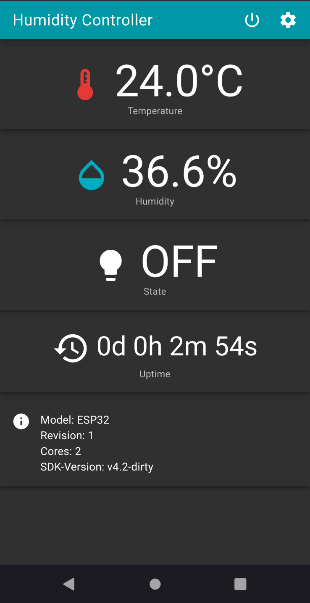
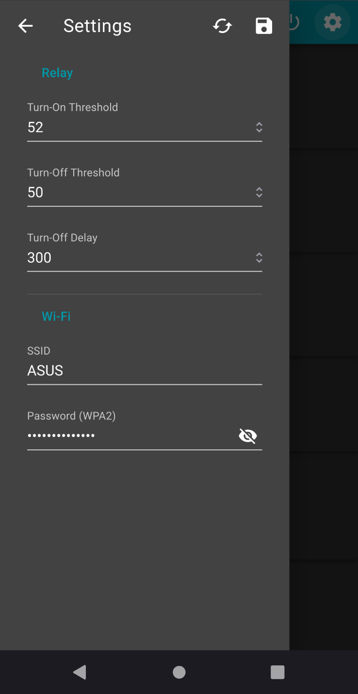

# ESP Humidity Controller

Control a relay based on the current humidity!  
This software was created with the [ESP-IDF](https://docs.espressif.com/projects/esp-idf/en/latest/esp32/).

## Screenshots

## Features

- Display current temperature and humidity
- Web interface
- Wi-Fi Station or Access Point
- Configurable humidity threshold
- Configurable turn off delay (in seconds)

## Requirements

- A working [ESP-IDF environment](https://docs.espressif.com/projects/esp-idf/en/latest/esp32/get-started/index.html)

## Hardware Requirements

- ESP32
- DHT22 - [AliExpress](https://www.aliexpress.com/item/32769460765.html?spm=a2g0s.9042311.0.0.55084c4d6TIJMa)/[Adafruit](https://learn.adafruit.com/dht)
- Relay Module - [AliExpress](https://www.aliexpress.com/item/33003900390.html?spm=a2g0s.9042311.0.0.55084c4d6TIJMa)

## Reference

Most of the code was adapted form the following examples:

- [`storage/nvs_rw_blob`](https://github.com/espressif/esp-idf/tree/master/examples/storage/nvs_rw_blob)
- [`wifi/getting_started/softAP`](https://github.com/espressif/esp-idf/tree/master/examples/wifi/getting_started/softAP)
- [`wifi/getting_started/station`](https://github.com/espressif/esp-idf/tree/master/examples/wifi/getting_started/station)
- [`protocols/http_server/restful_server`](https://github.com/espressif/esp-idf/tree/master/examples/protocols/http_server/restful_server)

